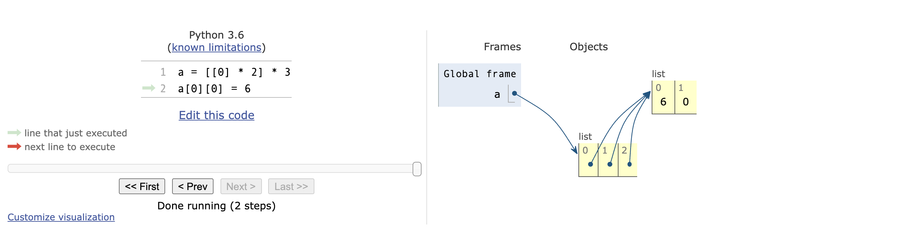
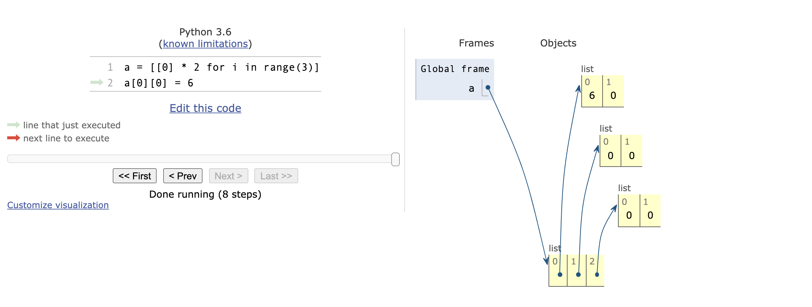
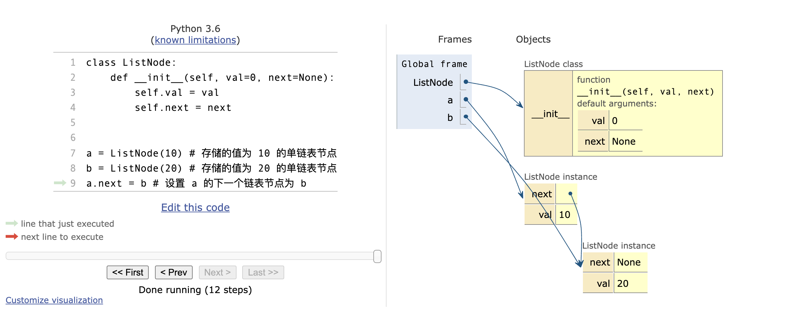
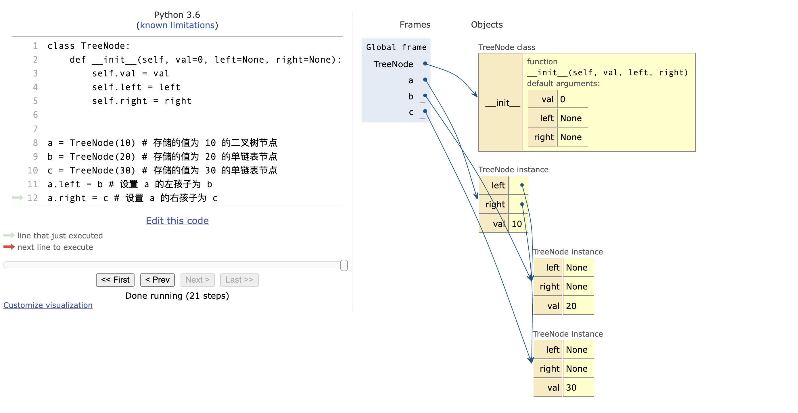
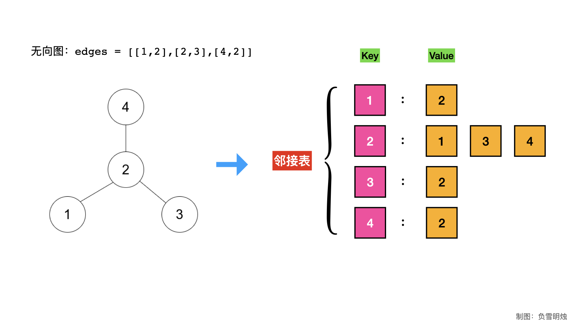
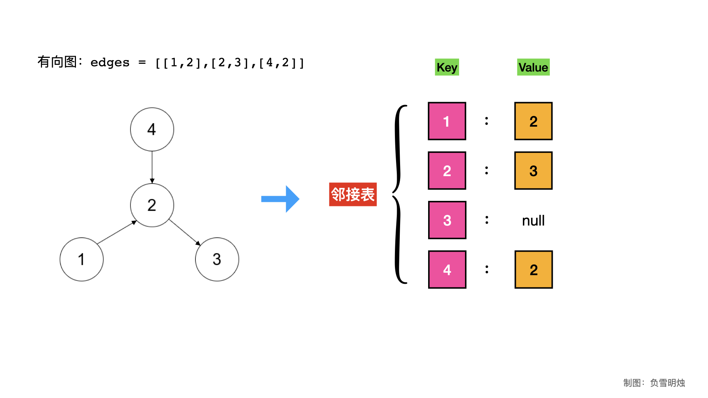
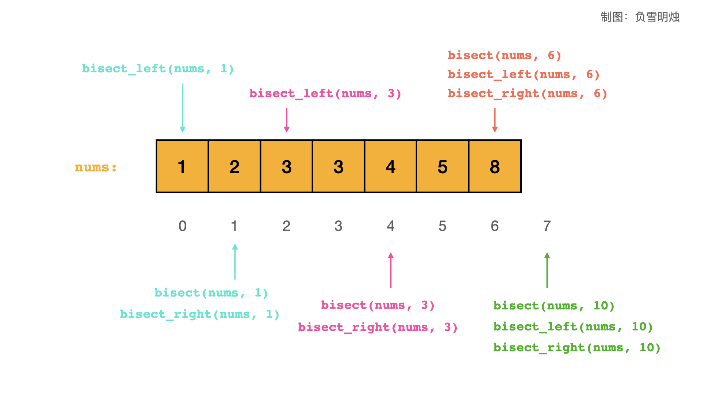

# Python 刷题速成手册

本文用于在刷 LeetCode 过程中如何利用 Python 实现常见的数据结构和算法，同时讲解了时间复杂度、以及刷题中可能遇到的一些坑。

**适合人群**：

- 已经掌握了 Python 基本的语法，了解过基本的数据结构，刚开始刷算法题的同学；
- 想躲坑、想速成算法题的同学；
- 想查缺补漏、快速复习的同学。

阅读本文的需要的前置知识：

- Python 基本语法；
- 常见的数据结构；

 本文中演示代码执行情况的图片都来自Python 在线代码演示网站 [PythonTour](https://pythontutor.com/visualize.html#mode=edit)。

## 数据结构

上面讲了 Python 的基本数据类型，包括字符串、列表、元组、字典、集合的基本用法。

这一节讲在刷题的过程中，一些常用的数据结构怎么实现和使用，包括：数组、栈、队列、哈希表、哈希集合、链表、树、堆、图。

### 数组（列表）

#### 定义和使用

Python 中的数组用列表 list 实现。

一维数组定义的格式为`[初始值] * 长度` 。

```python
>>> a = [0] * 10
>>> a
[0, 0, 0, 0, 0, 0, 0, 0, 0, 0]
```

二维数组定义的时候有坑，格外注意！！

二维数组错误的定义方法：

```python
>>> a = [[0] * 2] * 3
>>> a
[[0, 0], [0, 0], [0, 0]]
>>> a[0][0] = 6 # 修改第 1 行第 1 列的元素为 6
>>> a # 发现所有行的第 1 列元素全部变成了 6
[[6, 0], [6, 0], [6, 0]]
```

上述定义方法错误的原因：当 `[[0] * 2] * 3` 时，是把 `[0] * 2`的地址复制了 3 遍。

```python
>>> a = [[0] * 2] * 3
>>> id(a[0])
4381890056
>>> id(a[1])
4381890056
>>> id(a[2])
4381890056
```

使用[Python 可视化工具生成的二维数组**错误**声明方法，效果如下：




**二维数组的正确定义方法**：

```python
>>> a = [[0] * 2 for i in range(3)]
>>> a
[[0, 0], [0, 0], [0, 0]]
>>> a[0][0] = 6
>>> a
[[6, 0], [0, 0], [0, 0]]
```

使用[Python 可视化工具生成的二维数组**正确**声明方式](https://pythontutor.com/visualize.html#code=a%20%3D%20%5B%5B0%5D%20*%202%20for%20i%20in%20range%283%29%5D%0Aa%5B0%5D%5B0%5D%20%3D%206&cumulative=false&curInstr=8&heapPrimitives=nevernest&mode=display&origin=opt-frontend.js&py=3&rawInputLstJSON=%5B%5D&textReferences=false)，效果如下：




#### 优点

1. 可以按照下标访问元素（随机访问），时间复杂度是$O(1)$；
2. 可扩缩容，即 `append()` 和 `pop()`。

#### 缺点

1. 当向数组中的某个位置插入元素时，需要将该位置后面的元素都后移，因此插入和删除的平均时间复杂度是 $O(N)$。
2. 不能通过字符串形式的 key 访问元素。

#### 适用场景

1. 最长使用的数据结构。大多数题目的输入和输出都用的数组；
2. 动态规划中需要用数组保存每个位置的状态；
3. 回溯法使用数组保存访问过的路径。

### 栈

#### 定义和使用

- Python 中的栈使用列表 list 实现。

- 定义一个空的 list，使用`append(x)`和`pop()`方法，即实现了向栈顶插入元素、弹出栈顶元素。

```python
>>> a = []
>>> a.append(0) # 插入 0
>>> a.append(1) # 插入 1
>>> a
[0, 1]
>>> a.pop() # 弹出栈顶元素
1
>>> a
[0]
>>> a.pop() # 弹出栈顶元素
0
>>> a
[]
```

你可能有疑问：数组和栈都使用 list 实现，那么怎么知道 list 表示的是数组还是栈呢？

- 记住自己定义的变量的含义，比如可以用变量名区分；
- Python 不做语法层面的保证，比如你也可以通过 `insert(pos, x)`方法向栈的 `pos` 位置插入 `x`。

#### 特点

1. 插入/弹出的操作的时间复杂度是 $O(1)$；
2. 后入后出。

#### 适用场景

1. 判断字符串是否为有效的括号；
2. 逆波兰表达式求值；
3. 单调栈。

### 队列

#### 定义和使用

- 实现队列的方法是使用双端队列 deque，在 deque 的右边插入 `append(x)`，从 deque 的左边弹出 `popleft()`。

- **注意**：虽然列表 list 可以通过在开头插入和删除元素模拟一个栈，但是由于操作的时间复杂度是$O(N)$，所以我们不这么做。
- deque 在 collection 模块中，而 LeetCode 后台已经帮我们 `import collections`，不用自己 `import`。

```python
>>> a = collections.deque()
>>> a
deque([])
>>> a.append(0) # 插入 0
>>> a.append(1) # 插入 1
>>> a
deque([0, 1])
>>> a.popleft() # 弹出队列头部元素
0
>>> a
deque([1])
>>> a.popleft() # 弹出队列头部元素
1
>>> a
deque([])

```

**画外音**：如果在 deque 的右边插入，右边弹出，那么就相当于模拟了一个栈。

#### 特点

1. 插入/弹出的操作的时间复杂度是$O(1)$。
2. 先进先出

#### 适用场景

1. 广度优先搜索 BFS；
2. 滑动窗口。

### 哈希表（字典）

#### 定义和使用

- 用字典 dict 实现。

```python
>>> a = {"a" : 1, "b" : 3, "c" :9} # 声明和初始化，也可以用 a = dict() 声明空的字典
>>> len(a) # 元素个数
3
>>> a["d"] = 100 # 插入 Key-Value
>>> a["b"] = 666 # 插入 Key-Value
>>> a
{'a': 1, 'c': 9, 'b': 666, 'd': 100}
>>> a = {"a" : 1, "b" : 3, "c" :9}
>>> a.pop("c") # 删除 Key
9
>>> a
{'a': 1, 'b': 3}
>>> del a["b"] # 删除 Key
>>> a
{'a': 1}
```

#### 特点

1. 插入/修改/查找/删除的时间复杂度是 $O(1)$。
2. 遍历里面的元素时，是无序的（既不是插入顺序，也不是字典顺序）；
3. 自动对 key 去重。

#### 适用场景

1. 各种需要保存 Key-Value 的场景；
2. 保存数组中一个数字出现的第一次/最后一次的位置；
3. 记忆化搜索；
4. LRU 缓存；
5. 统计元素的出现次数。

### 哈希集合

#### 定义和使用

- 用哈希集合 set 实现。

```python
>>> a = {1, 2, 3} # 声明和初始化，也可以用 a = set() 声明空的哈希集合
>>> len(a) # 元素个数
3
>>> a.add(4) # 增加一个新的元素
>>> a
set([1, 2, 3, 4])
>>> a.add(3) # 增加一个已经存在的元素
>>> a
set([1, 2, 3, 4])
>>> a.remove(3) # 删除元素
>>> a
set([1, 2])
```

#### 特点

1. 插入/查找/删除的时间复杂度是 $O(1)$。
2. 遍历里面的元素时，是无序的（既不是插入顺序，也不是字典顺序）；
3. 自动去重。

#### 适用场景

1. 需要去重的场景；
2. 判断元素是否出现过；

### 链表

#### 定义和使用

- LeetCode 中一般不需要自己定义链表节点，做链表题目的时候，题目本身就已经定义好了链表结构，可以直接用。

单链表的定义

```python
# Definition for singly-linked list.
# class ListNode:
#     def __init__(self, val=0, next=None):
#         self.val = val
#         self.next = next
```

单链表的构建

```python
a = ListNode(10) # 存储的值为 10 的单链表节点
b = ListNode(20) # 存储的值为 20 的单链表节点
a.next = b # 设置 a 的下一个链表节点为 b
```

效果如下（使用 [Python 代码可视化生成](https://pythontutor.com/visualize.html#code=class%20ListNode%3A%0A%20%20%20%20def%20__init__%28self,%20val%3D0,%20next%3DNone%29%3A%0A%20%20%20%20%20%20%20%20self.val%20%3D%20val%0A%20%20%20%20%20%20%20%20self.next%20%3D%20next%0A%20%20%20%20%20%20%20%20%0A%20%20%20%20%20%20%20%20%0Aa%20%3D%20ListNode%2810%29%20%23%20%E5%AD%98%E5%82%A8%E7%9A%84%E5%80%BC%E4%B8%BA%2010%20%E7%9A%84%E5%8D%95%E9%93%BE%E8%A1%A8%E8%8A%82%E7%82%B9%0Ab%20%3D%20ListNode%2820%29%20%23%20%E5%AD%98%E5%82%A8%E7%9A%84%E5%80%BC%E4%B8%BA%2020%20%E7%9A%84%E5%8D%95%E9%93%BE%E8%A1%A8%E8%8A%82%E7%82%B9%0Aa.next%20%3D%20b%20%23%20%E8%AE%BE%E7%BD%AE%20a%20%E7%9A%84%E4%B8%8B%E4%B8%80%E4%B8%AA%E9%93%BE%E8%A1%A8%E8%8A%82%E7%82%B9%E4%B8%BA%20b&cumulative=false&curInstr=12&heapPrimitives=nevernest&mode=display&origin=opt-frontend.js&py=3&rawInputLstJSON=%5B%5D&textReferences=false)）：



#### 特点

1. 在指针指向的节点后面**插入**节点的时间复杂度是 $O(1)$；
2. 在指针指向的节点后面删除节点的时间复杂度是 $O(1)$；
3. 查找某个节点的时间复杂度是 $O(N)$；
4. 如果一直在链表头部/尾部插入元素，那么遍历的时候是有序的（插入顺序）。

#### 适用场景

1. 大部分链表题目都是给定了链表，让你执行某种操作，很少题目是让你主动选择使用链表（特例如 LRU）；
2. 当要求有序的情况下，可以考虑链表（数组也是有序的，优先考虑数组）；
3. LRU 缓存机制。

### 树

#### 定义和使用

- LeetCode 中一般不需要自己定义树节点，做树题目的时候，题目本身就已经定义好了树结构，可以直接用。
- 树有很多变种：二叉树（二叉搜索树、平衡二叉树）、多叉树、字典树等。

二叉树的定义

```python
# Definition for a binary tree node.
# class TreeNode:
#     def __init__(self, val=0, left=None, right=None):
#         self.val = val
#         self.left = left
#         self.right = right
```

二叉树的构建

```python
a = TreeNode(10) # 存储的值为 10 的二叉树节点
b = TreeNode(20) # 存储的值为 20 的单链表节点
c = TreeNode(30) # 存储的值为 30 的单链表节点
a.left = b # 设置 a 的左孩子为 b
a.right = c # 设置 a 的右孩子为 c
```

效果如下（使用 [Python 代码可视化生成](https://pythontutor.com/visualize.html#code=class%20TreeNode%3A%0A%20%20%20%20def%20__init__%28self,%20val%3D0,%20left%3DNone,%20right%3DNone%29%3A%0A%20%20%20%20%20%20%20%20self.val%20%3D%20val%0A%20%20%20%20%20%20%20%20self.left%20%3D%20left%0A%20%20%20%20%20%20%20%20self.right%20%3D%20right%0A%20%20%20%20%20%20%20%20%0A%20%20%20%20%20%20%20%20%0Aa%20%3D%20TreeNode%2810%29%20%23%20%E5%AD%98%E5%82%A8%E7%9A%84%E5%80%BC%E4%B8%BA%2010%20%E7%9A%84%E4%BA%8C%E5%8F%89%E6%A0%91%E8%8A%82%E7%82%B9%0Ab%20%3D%20TreeNode%2820%29%20%23%20%E5%AD%98%E5%82%A8%E7%9A%84%E5%80%BC%E4%B8%BA%2020%20%E7%9A%84%E5%8D%95%E9%93%BE%E8%A1%A8%E8%8A%82%E7%82%B9%0Ac%20%3D%20TreeNode%2830%29%20%23%20%E5%AD%98%E5%82%A8%E7%9A%84%E5%80%BC%E4%B8%BA%2030%20%E7%9A%84%E5%8D%95%E9%93%BE%E8%A1%A8%E8%8A%82%E7%82%B9%0Aa.left%20%3D%20b%20%23%20%E8%AE%BE%E7%BD%AE%20a%20%E7%9A%84%E5%B7%A6%E5%AD%A9%E5%AD%90%E4%B8%BA%20b%0Aa.right%20%3D%20c%20%23%20%E8%AE%BE%E7%BD%AE%20a%20%E7%9A%84%E5%8F%B3%E5%AD%A9%E5%AD%90%E4%B8%BA%20c&cumulative=false&curInstr=21&heapPrimitives=nevernest&mode=display&origin=opt-frontend.js&py=3&rawInputLstJSON=%5B%5D&textReferences=false)）：



#### 特点

1. 插入/删除左孩子或者右孩子的时间复杂度是$O(1)$；

#### 适用场景

1. 树的变化比较多，考察点丰富，一般会与 BFS、DFS 结合。
2. 大部分树题目都是给定了树，让你执行某种操作，很少题目是让你主动选择使用树（特例如字典树）；
3. 二叉树相关：深度、翻转、镜像、对称、各种遍历；
4. 二叉搜索树相关：验证、搜索、迭代器、范围和；
5. 多叉树相关：类似于二叉树。
6. 字典树相关：搜索单词、单词替换、单词匹配；

### 堆

堆通常是一个可以被看做一棵完全二叉树的数组对象。

堆满足下列性质：

- 堆中某个节点的值总是不大于或不小于其父节点的值。
- 堆总是一棵完全二叉树。

#### 定义和使用

- Python 中，堆不是一个专门的数据结构，而是一个算法。因为算法是作用于数据结构上的，堆算法对应的数据结构就是列表 list。

- Python 堆的模块是 `heapq`, LeetCode 后台已经帮我们 `import heapq`，不用自己 `import`。
- **Python 的堆默认是小根堆**。

堆的定义和使用方法：

- 定义一个堆，就是定义一个列表 list。

- 向堆中插入元素的方法 `heapq.heappush(h, x)`。

- 堆中的最小元素就是堆顶元素，即 `h[0]`。

- 弹出堆顶元素的方法是 `heapq.heappop(h)`。

- 从一个已有的列表初始化堆：`heapq.heapify(h)`。

```python
>>> h = [] # 声明一个空的小根堆（即 list）
>>> heapq.heappush(h, 1) # 向小根堆中插入元素 1
>>> h
[1]
>>> heapq.heappush(h, 2) # 向小根堆中插入元素 2
>>> h
[1, 2]
>>> heapq.heappush(h, 3) # 向小根堆中插入元素 3
>>> h
[1, 2, 3]
>>> heapq.heappush(h, 1) # 向小根堆中插入元素 1
>>> h
[1, 1, 3, 2]
>>> heapq.heappop(h) # 弹出堆顶元素，返回值是弹出的堆顶元素 1
1
>>> h
[1, 2, 3]
>>> heapq.heappop(h) # 弹出堆顶元素，返回值是弹出的堆顶元素 1
1
>>> h
[2, 3]
>>> heapq.heappop(h) # 弹出堆顶元素，返回值是弹出的堆顶元素 2
2
>>> h
[3]
>>> heapq.heappop(h) # 弹出堆顶元素，返回值是弹出的堆顶元素 3
3
>>> h
[]
>>> h = [3,4,1,2] # 给了一个已有的列表
>>> heapq.heapify(h) # 从一个已有的列表初始化小根堆
>>> h
[1, 2, 3, 4]
```

**问题来了：Python 怎么定义大根堆？**

Python 中是没有大根堆的。可以通过小根堆来实现大根堆：把数值颠倒正负号，放入堆中；当弹出元素的时候，颠倒该元素的正负号，从而还原原本的数值。

举例：

```python
>>> h = [] # 声明一个空的大根堆（即 list）
>>> heapq.heappush(h, -1) # 向大根堆中插入元素 1，插入时对元素取反，即插入 -1
>>> h
[-1]
>>> heapq.heappush(h, -2) # 向大根堆中插入元素 2，插入时对元素取反，即插入 -2
>>> h
[-2, -1]
>>> heapq.heappush(h, -3) # 向大根堆中插入元素 3，插入时对元素取反，即插入 -3
>>> h
[-3, -1, -2]
>>> x = heapq.heappop(h) # 弹出堆顶元素，返回值是弹出的堆顶元素 -3
>>> -x # 将弹出的元素取反，还原成插入时的元素 3
3
>>> x = heapq.heappop(h) # 弹出堆顶元素，返回值是弹出的堆顶元素 -2
>>> -x # 将弹出的元素取反，还原成插入时的元素 2
2
>>> h
[-1]
>>> x = heapq.heappop(h)  # 弹出堆顶元素，返回值是弹出的堆顶元素 -1
>>> -x # 将弹出的元素取反，还原成插入时的元素 1
1
```

#### 特点

1. **插入/弹出**的时间复杂度是 $O(log N)$；
2. 在堆中**查找**元素的时间复杂度是 $O(N)$，因为最差情况下需要把所有的元素遍历一遍；
3. 读取当前堆顶元素的操作为 `h[0]`，时间复杂度是`O(1)`；
4. 把已有的数组构建成堆，时间复杂度是 $O(N)$。

#### 适用场景

1. 构建优先级队列：贪心算法中很可能用到。
2. TopK：数据流中的最大的 K 个数字，最高频的 K 个数字等，只要题目中有「最 xx 的 K 个元素」就考虑堆。

### 图

#### 定义和使用

##### 题目给的输入

一般情况下，LeetCode 图的题目都是题目会给你一个图，然后让你求解，也就是说图的题目其实是比较明显的。

LeetCode 中给的图都是用二维整数数组 `edges` 进行表示，其中 `edges[i] = [ui, vi]` 表示在节点 `ui` 和 `vi` 之间存在一条边。

**要注意题目给出的是有向图还是无向图。**

以[1791. 找出星型图的中心节点](https://leetcode-cn.com/problems/find-center-of-star-graph/)为例，可以看懂这种图的表示方法：


上面这张图对应的 `edges = [[1,2],[2,3],[4,2]]` ，题目中也说了这是一个无向图。

##### 图的邻接表表示法

对于有的题目来说，题目给出的图的二维整数数组的表示方法已经够用了，不需要再转化成其他图的表示方法。

但是当我们需要对图做 DFS/BFS 遍历的时候，那么我们就需要知道某个节点有哪些相邻节点。则需要把二维整数数组转化成图的其他表示方法，一般为**邻接表表示法**。

邻接表表示法，一般形式为一个字典：

- key 是节点的值；
- value 为一个列表 list / 哈希集合 set：
  - 无向图：用于表示此节点的相邻节点；
  - 有向图：用于表示此节点指向的节点。

举个例子，还是上面的 `edges = [[1,2],[2,3],[4,2]]` 表示的**无向图**。我们用邻接表表示法，示意图为：

#### 

对应的 Python 代码为：

```python
graph = collections.defaultdict(list)
for edge in edges:
		graph[edge[0]].append(edge[1])
		graph[edge[1]].append(edge[0])
print(graph)
```

如果 `edges = [[1,2],[2,3],[4,2]]` 表示的**有向图**，即从每条边从 `edge[0]`指向 `edge[1]` 。我们用邻接表表示法，示意图为：



对应的 Python 代码为：

```python
graph = collections.defaultdict(list)
for edge in edges:
    graph[edge[0]].append(edge[1])
print(graph)
```

#### 特点

1. 向邻接表中插入节点与邻接节点的时间复杂度是 $O(1)$；
2. 当需要删除邻接节点时，应该把邻接表中的 value 定义为哈希集合 set 格式，删除邻接节点的时间复杂度是 $O(1)$；
3. 从邻接表中获取一个节点的相邻节点，时间复杂度是 $O(1)$；

#### 适用场景

1. 图的题目基本上很明显；
2. 图的算法有很多，常考的有：入度/出度、DFS、BFS、拓扑排序；
3. LeetCode 的图都基于邻接表表示。

## 算法

### 排序

这里不讲解具体的排序算法，只讲解怎么调用库函数实现排序。

#### `sorted()` 函数

`sorted()` 是 Python 自带的库函数，可以实现对所有可迭代对象进行排序。注意 `sorted()` 函数在 Python2 和 Python3 中有所不同，本文基于  Python3 讲解。

`sorted()`的格式为：

```python
sorted(iterable, key=None, reverse=False)
```

参数说明：

- `iterable` ：可迭代对象。
- `key` ：主要是用来进行比较的元素，只有一个参数，具体的函数的参数就是取自于可迭代对象中，指定可迭代对象中的一个元素来进行排序。
- `reverse` ：排序规则，`reverse = True` 降序 ， `reverse = False` 升序（默认）。

下面以对一个列表进行排序为例：

```python
>>> a = [4,3,8,6,1,9]
>>> b = sorted(a) # sorted() 返回一个新的列表
>>> b
[1, 3, 4, 6, 8, 9]
>>> a # sorted() 不会影响输入参数
[4, 3, 8, 6, 1, 9]
>>> b = sorted(a, reverse=True) # 从大到小排序
>>> b
[9, 8, 6, 4, 3, 1]
>>> a = [('c', 1), ('z', 4), ('a', 5), ('e', 2), ('g', 6)] # list 中存放的是 tuple
>>> a
[('c', 1), ('z', 4), ('a', 5), ('e', 2), ('g', 6)]
>>> b = sorted(a) # sorted() 默认按照 tuple 的第一个值进行排序
>>> b
[('a', 5), ('c', 1), ('e', 2), ('g', 6), ('z', 4)]
>>> b = sorted(a, key=lambda x : x[1]) # 使用 key 指定 sorted() 按照 tuple 的第 2 个值进行排序
>>> b
[('c', 1), ('e', 2), ('z', 4), ('a', 5), ('g', 6)]
>>> b = sorted(a, key=lambda x : x[1], reverse=True) # 使用 key 指定 sorted() 按照 tuple 的第 2 个值进行排序，并且降序排序
>>> b
[('g', 6), ('a', 5), ('z', 4), ('e', 2), ('c', 1)]
```

- `sorted() `时间复杂度：$O(N*log(N))$；
- `sorted()`空间复杂度：$O(N)$，因为返回的是个新数组。

#### 对列表 list 排序

对列表 list  的排序方法有两种：

1. 调用系统的排序函数 `sorted(a)`，这个函数返回一个新的有序列表，而不影响输入的列表的。
2. 使用列表 list 的函数 `a.sort()`，这个函数直接对列表进行排序，是原地排序的，无返回值。

`sort()`函数的参数与 `sorted()`相同。

举例：

```python
>>> a = [4,3,8,6,1,9]
>>> b = sorted(a) # sorted(a) 返回一个新的列表
>>> b
[1, 3, 4, 6, 8, 9]
>>> a # 使用 sorted(a) 不会影响 a
[4, 3, 8, 6, 1, 9]
>>> a.sort() # 使用 a.sort() 会对 a 直接排序
>>> a
[1, 3, 4, 6, 8, 9]
>>> a.sort(reverse=True) # 使用 reverse=True 对 a 降序排序
>>> a
[9, 8, 6, 4, 3, 1]
>>> a = [('c', 1), ('z', 4), ('a', 5), ('e', 2), ('g', 6)] # list 中元素为 tuple
>>> a.sort(key=lambda x: x[1]) # 使用 key 指定 sorted() 按照 tuple 的第 2 个值进行排序
>>> a
[('c', 1), ('e', 2), ('z', 4), ('a', 5), ('g', 6)]

```

- `a.sort()`时间复杂度：$O(N*log(N))$；
- `a.sort()`空间复杂度：$O(1)$，因为在原数组上操作。

#### 对哈希表（字典）排序

对哈希表（字典）进行排序，有两种情况：

1. 对哈希表（字典）的 key 进行排序
2. 对哈希表（字典）的 value 进行排序

使用 `sorted()` 函数进行排序，哈希表（字典）没有 `sort()`方法。

- 如果直接对字典排序，其实是获取了字典的所有 key 并且排序。

- `a.items()` 将获取哈希表（字典） a 的所有元素，按照 list 形式给出，值为 tuple 格式，第一个元素表示 key，第二个元素表示 value。

**注意**：`sorted(a.items())`返回值是个排序后的列表，而原来的字典是没有变化的，不可能对字典本身进行排序。

举例：

```python
>>> a = {'v': 8, 'a' : 2, 'd': 5, 'j': 1, 'z': 3} # 定义一个字典
>>> a # 默认是无序的
{'a': 2, 'j': 1, 'd': 5, 'z': 3, 'v': 8}
>>> sorted(a) # 默认是获取字典的所有 key 并且排序
['a', 'd', 'j', 'v', 'z']
>>> a.items() # 获取字典的所有元素
[('a', 2), ('j', 1), ('d', 5), ('z', 3), ('v', 8)]
>>> sorted(a.items()) # 获取字典的所有元素，并且按照 key 排序
[('a', 2), ('d', 5), ('j', 1), ('v', 8), ('z', 3)]
>>> sorted(a.items(), reverse=True) # 获取字典的所有元素，并且按照 key 逆序排序
[('z', 3), ('v', 8), ('j', 1), ('d', 5), ('a', 2)]
>>> sorted(a.items(), key=lambda x : x[1]) # 获取字典的所有元素，并且按照 value 排序
[('j', 1), ('a', 2), ('z', 3), ('d', 5), ('v', 8)]
>>> sorted(a.items(), key=lambda x : x[1], reverse=True) # 获取字典的所有元素，并且按照 value 逆序排序
[('v', 8), ('d', 5), ('z', 3), ('a', 2), ('j', 1)]
```

### 二分查找

在刷题的时候，我们偶尔会遇到需要对有序列表进行二分查找的情况。这个时候，我们可以动手写一个二分查找算法，也可以调用 Python 内置的二分查找算法。

本节的 `bisect` 只做了解，不要求掌握。

Python 内置的二分查找算法在 `bisect` 模块里面，共有 3 个函数。

- `bisect_left(nums, x) `：在 `nums` 中寻找插入 `x` 的位置 `i` ，如果有相同元素，则插在所有相同元素的第一个位置。也就是说，区间`[0, i)` 内的元素都小于 `x`，同时`[i, len(nums) - 1]`的元素都大于等于 `x`。注意，`nums[i] = x`，即 `nums[i]` 为第一个等于 `x` 的元素的位置。

- `bisect(nums, x)` ：在 `nums` 中寻找插入 `x` 的位置 `i` ，如果有相同元素，则插在所有相同元素的右侧。也就是说，区间`[0, i)` 内的元素都小于等于 `x`，同时`[i, len(nums) - 1]`的元素都大于 `x`。注意，`nums[i] != x`，而是 `nums[i]` 为第一个大于 `x` 的元素的位置。
- `bisect_right(nums, x)`：与 `bisect` 含义相同。

用一张图表示这个三个函数的调用情况：



和上面的图对应的代码：

```python
>>> import bisect
>>> nums = [1, 2, 3, 3, 4, 5, 8] # 必须是有序数组
>>> bisect.bisect_left(nums, 1) # 查找插入 1 的位置，没有相同元素，则插在该元素的位置
0
>>> bisect.bisect(nums, 1) # 查找插入 1 的位置，没有相同元素，放在该元素的右侧
1
>>> bisect.bisect_right(nums, 1) # 查找插入 1 的位置，没有相同元素，放在该元素的右侧
1
>>> bisect.bisect_left(nums, 3) # 查找插入 3 的位置，有相同元素，则插在第一个位置
2
>>> bisect.bisect(nums, 3) # 查找插入 3 的位置，有相同元素，放在所有相同元素的右侧
4
>>> bisect.bisect_right(nums, 3) # 查找插入 3 的位置，有相同元素，放在所有相同元素的右侧
4
>>> bisect.bisect_left(nums, 10) # 查找插入 10 的位置，没有找到元素，则返回理论上应该插入的位置
7
>>> bisect.bisect(nums, 10) # 查找插入 10 的位置，没有找到元素，则返回理论上应该插入的位置
7
>>> bisect.bisect_right(nums, 10) # 查找插入 3 的位置，没有找到元素，则返回理论上应该插入的位置
7
>>> bisect.bisect(nums, 6) # 查找插入 6 的位置，没有找到元素，则返回理论上应该插入的位置
6
>>> bisect.bisect_left(nums, 6) # 查找插入 6 的位置，没有找到元素，则返回理论上应该插入的位置
6
>>> bisect.bisect_right(nums, 6) # 查找插入 6 的位置，没有找到元素，则返回理论上应该插入的位置
6
```

- 时间复杂度：$O(log(N))$；
- 空间复杂度：$O(1)$。


至此，我们已经了解了 Python 刷题常用的数据结构和算法，可以开始愉快地刷题之旅啦！

没记住也没关系，现在先有个大致的印象。在接下来的章节里，还会反复使用上面的数据结构和算法。


参考资料：

1. [菜鸟教程-堆](https://www.runoob.com/data-structures/heap-storage.html)
2. [数据结构：堆（Heap）](https://www.jianshu.com/p/6b526aa481b1)
2. [Python sorted() 函数](https://www.runoob.com/python/python-func-sorted.html)

